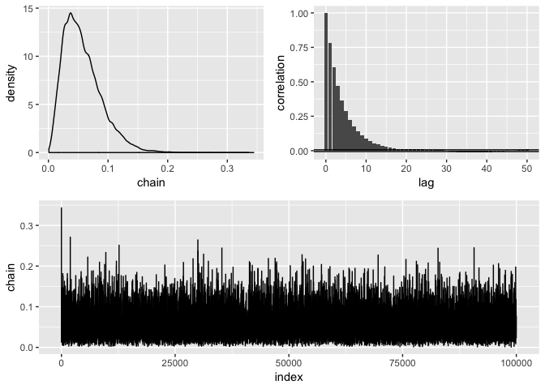

binfer
================

[](https://travis-ci.org/nicksolomon/binfer) [](https://codecov.io/gh/nicksolomon/binfer)

This package aims to make doing Bayesian things a little easier by giving a clear set of steps that you can easily use to simulate draws from a posterior distribution defined by a specific likelihood and prior.

The steps
---------

1.  `define` a likelihood

-   Input: A data frame, a formula with the response variable and the name of a function that is your likelihood.
-   Output: A data frame with the name of the function given at input as an attribute

1.  `assume` a prior distribution

-   Input: A data frame and a function of a single variable
-   Ouput: A data frame with the name of the function added as an attribute

1.  `draw` from the posterior distribution

-   Input: A data frame, a control parameter
-   Output: A data frame of draws from the posterior distribution

1.  `diagnose` the chain:

-   Input: a data frame of draws from the posterior
-   Output: The same data frame and a bunch of diagnostic plots

1.  `clean` the chain

-   Input: Draws from the posterior
-   Output: Burned-in and subsampled draws from the posterior

1.  Construct your confidence interval or p-value

-   Use `dplyr` for this

Examples
--------

Let's check our simulations by comparing the results to an analytically tractable problem. We'll use count data that we assume follows a poisson distribution. The prior we choose is the conjugate prior, a gamma distribution. The posterior should be a gamma distribution as well. Let's see if that's what we get!

``` r
library(binfer)
library(tidyverse)
#> Loading tidyverse: ggplot2
#> Loading tidyverse: tibble
#> Loading tidyverse: tidyr
#> Loading tidyverse: readr
#> Loading tidyverse: purrr
#> Loading tidyverse: dplyr
#> Warning: package 'tibble' was built under R version 3.4.3
#> Conflicts with tidy packages ----------------------------------------------
#> filter(): dplyr, stats
#> lag():    dplyr, stats

set.seed(20180127)

# Load taxis dataset
data("taxis")

# Define the prior and the likelihood
my_lik <- function(data, theta) {if (theta > 0) dpois(data, lambda = theta) else 0}
my_prior <- function(theta) {dgamma(theta, rate = 10, shape = 10)} 

# Sample the data to reduce runtimes
taxis_small <- taxis %>%
  sample_frac(.1)

# Do the binfer steps
posterior <- taxis_small %>% 
  define(passenger_count ~ my_lik) %>% 
  assume(~ my_prior) %>% 
  draw(initial = mean(taxis$passenger_count), nbatch = 1e5, blen = 1, scale = .1) %>% 
  diagnose() %>% 
  clean(burnin = 1000, subsample = 15) %>% 
  diagnose()
#> Acceptance rate: 0.277132771327713
#> Acceptance rate: 0.991210789513563
```


``` r

# Calculate the analytical hyperparameters
hyper1 <- 10 + sum(taxis_small$passenger_count)
hyper2 <- 10 + length(taxis_small$passenger_count)

# Analytic mean estimator
hyper1/hyper2
#> [1] 1.765281

# Our mean estimator
posterior %>% 
  summarize(mean = mean(chain))
#>       mean
#> 1 1.764866

# Plot the simulated density against the analytical density
ggplot(posterior, aes(chain)) + 
  geom_density() +
  stat_function(fun = dgamma, args = list(hyper1, hyper2), color = "red")
```


Estimate the standard deviation of a normal distribution with a gamma prior:

``` r
library(binfer)
library(tidyverse)

my_lik <- function(data, theta) {if (theta > 0) dnorm(data, mean = mean(iris$Sepal.Width) , sd = theta) else 0}
my_prior <- function(theta) {dgamma(theta, shape = 10, rate = 20)}

posterior <- define(iris, Sepal.Width ~ my_lik) %>% 
  assume(prior = ~ my_prior) %>% 
  draw(initial = .43, nbatch = 1e5, blen = 1, scale = .05) %>% 
  diagnose() %>% 
  clean(burnin = 0, subsample = 20) %>% 
  diagnose()
#> Acceptance rate: 0.498814988149882
#> Acceptance rate: 1
```


``` r

posterior %>% summarise(mean = mean(chain),
                        sd = sd(chain),
                        lower = quantile(chain, .025),
                        upper = quantile(chain, .975))
#>        mean         sd     lower    upper
#> 1 0.4384707 0.02516674 0.3919626 0.490722
```

Estimate the probability of success of a binomnial distribution with a beta prior:

``` r
binom_test_data <- rbinom(50, prob = .1, size = 1) %>% 
  tibble(response = .)

binom_lik <- function(data, theta) {if(theta > 0 & theta < 1) dbinom(data, prob = theta, size = 1) else 0}
beta_prior <- function(theta) {dbeta(theta, 1, 2)}

posterior2 <- binom_test_data %>% 
  define(response ~ binom_lik) %>% 
  assume(~ beta_prior) %>% 
  draw(initial = .5, nbatch = 1e5, blen = 1, scale = .15) %>% 
  diagnose() %>% 
  clean(burnin = 1000, subsample = 30) %>% 
  diagnose()
#> Acceptance rate: 0.225462254622546
#> Acceptance rate: 0.998787511367081
```



``` r
posterior2 %>% 
  summarize(mean = mean(chain), 
            sd = sd(chain), 
            lower = quantile(chain, .025), 
            upper = quantile(chain, .975))
#> # A tibble: 1 x 4
#>     mean     sd  lower upper
#>    <dbl>  <dbl>  <dbl> <dbl>
#> 1 0.0575 0.0314 0.0125 0.131
```
